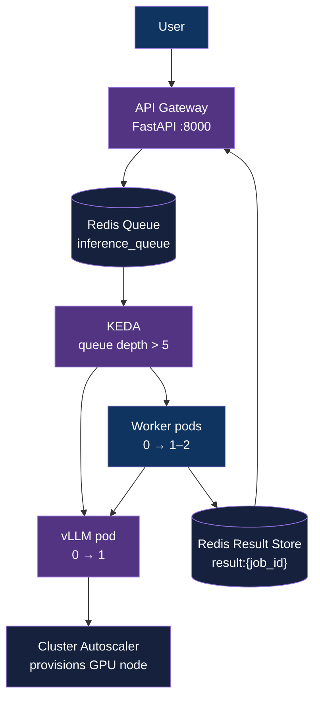

<div align="center">

# gpu-autoscale-inference

[](https://www.python.org/downloads/)
[](https://kubernetes.io/)
[](LICENSE)
[](#)

**A scale-to-zero GPU inference platform — GPU nodes provision on demand, cost is $0 when idle.**

[Architecture](#architecture) | [Getting Started](#getting-started) | [Demo](#demo)

</div>

---

## Table of Contents

- [Overview](#overview)
- [Features](#features)
- [Tech Stack](#tech-stack)
- [Architecture](#architecture)
- [Getting Started](#getting-started)
- [How It Works](#how-it-works)
- [Project Structure](#project-structure)
- [Roadmap](#roadmap)
- [Author](#author)

## Overview

This project demonstrates production-grade AI infrastructure engineering: an LLM inference platform where GPU resources are fully elastic. When request queue depth exceeds a threshold, KEDA scales worker pods from zero. In cloud deployment, a Cluster Autoscaler provisions the GPU virtual machine itself — so zero idle cost is not just pod-level but node-level.

The architecture mirrors inference platforms used by OpenAI, Anthropic, and Google — scaled down to a single GPU.

## Features

- **Scale-to-zero GPU** — GPU node provisions on demand, deprovisions when idle
- **Two-layer autoscaling** — KEDA (pod) + Cluster Autoscaler (node) working in tandem
- **Queue-driven inference** — Redis queue buffers requests during cold start; no dropped traffic
- **Async API** — fire-and-forget `/generate`, poll `/result/{job_id}`
- **Production observability** — Prometheus + Grafana + NVIDIA dcgm-exporter

## Tech Stack

| Layer | Tool |
|---|---|
| API Gateway | FastAPI |
| Queue + Result Store | Redis |
| Pod Autoscaler | KEDA |
| Node Autoscaler | Cluster Autoscaler (AKS / GKE) |
| Queue Consumer | Python worker |
| Inference Engine | vLLM + Qwen/Qwen2.5-1.5B-Instruct |
| Orchestration | Kubernetes |
| Observability | Prometheus + Grafana + dcgm-exporter |
| Load Testing | Locust |

## Architecture



### Two-Layer Autoscaling

| Layer | Tool | Trigger | What scales |
|---|---|---|---|
| Pod | KEDA | Redis queue depth > 5 | Worker + vLLM Deployments 0↔1 |
| Node | Cluster Autoscaler | Pending pod with GPU request | GPU VM 0↔1 |

## Getting Started

### Prerequisites

- Python 3.12+
- Docker with NVIDIA GPU support
- k3d (Phase 1 local) or cloud CLI: `az` / `gcloud` (Phase 2)
- kubectl, helm

### Phase 1 — Local

```bash
# 1. Start vLLM on host (uses local GPU directly)
docker run --gpus all -p 8000:8000 --ipc=host \
  vllm/vllm-openai --model Qwen/Qwen2.5-1.5B-Instruct \
  --max-model-len 4096 --gpu-memory-utilization 0.8 --enforce-eager

# 2. Create local k3d cluster
k3d cluster create llm-gateway --port "8080:80@loadbalancer"

# 3. Install KEDA
helm repo add kedacore https://kedacore.github.io/charts
helm install keda kedacore/keda --namespace keda --create-namespace

# 4. Deploy all manifests
kubectl apply -f k8s/

# 5. Run load test
source .venv/bin/activate
locust -f loadtest/locustfile.py --host http://localhost:8080
```

### Phase 2 — Cloud (Azure AKS)

```bash
./scripts/deploy-azure.sh
kubectl apply -f k8s/
kubectl apply -f k8s-cloud/azure/
./scripts/destroy-azure.sh   # always run after session
```

### Configuration

```bash
cp .env.example .env
```

<details>
<summary>Configuration reference</summary>

```bash
# Worker: vLLM server URL
# Phase 1 (host Docker): http://host.docker.internal:8000
# Phase 2 (K8s Service):  http://vllm:8000
VLLM_URL=http://host.docker.internal:8000

REDIS_HOST=redis
REDIS_PORT=6379
```

</details>

## How It Works

### 1. Request Flow

Every prompt is enqueued immediately. `/generate` always returns a `job_id`. No request blocks for inference.

### 2. Autoscaling Chain

```
Queue depth > 5
→ KEDA scales Worker (0→1) + vLLM (0→1)
→ vLLM pod requests nvidia.com/gpu: 1
→ [cloud] Cluster Autoscaler provisions GPU node
→ vLLM loads model (~5-10s), readiness probe passes
→ Worker pulls jobs, calls vLLM, writes results
→ Queue drains → KEDA scales to 0 → GPU node removed
```

### 3. Result Retrieval

Poll `GET /result/{job_id}`. Returns `{status: pending}` until inference completes, then `{status: done, response: "..."}`. Results expire after 5 minutes.

## Demo

<!-- Add demo GIF/video after Phase 2 completion -->

*Demo recording: idle system (0 pods, 0 GPU nodes) → Locust load test → GPU node provisions → inference serves → everything scales to zero.*

## Project Structure

```
gpu-autoscale-inference/
├── gateway/                         # FastAPI gateway
├── worker/                          # Redis queue consumer
├── k8s/                             # Cloud-agnostic K8s manifests
├── k8s-cloud/azure/                 # AKS-specific node pool + GPU tolerations
├── k8s-cloud/gcp/                   # GKE-specific node pool + GPU tolerations
├── monitoring/                      # Prometheus + Grafana config
├── loadtest/                        # Locust load test
├── scripts/                         # Deploy + destroy scripts per environment
└── data/                            # Runtime artifacts (gitignored)
```

## Roadmap

See [ROADMAP.md](ROADMAP.md) for detailed version history and plans.

- [x] Repository scaffolded
- [ ] v0.1 Phase 1 — Local GPU prototype (k3d)
- [ ] v0.1 Phase 2 — Cloud GPU deployment (AKS/GKE), demo recording
- [ ] v0.2 — SSE streaming, model multiplexing

## Author

**Adityo Nugroho** ([@adityonugrohoid](https://github.com/adityonugrohoid))

## Acknowledgments

- [vLLM](https://github.com/vllm-project/vllm) — high-throughput LLM inference engine
- [KEDA](https://keda.sh) — Kubernetes Event-driven Autoscaling
