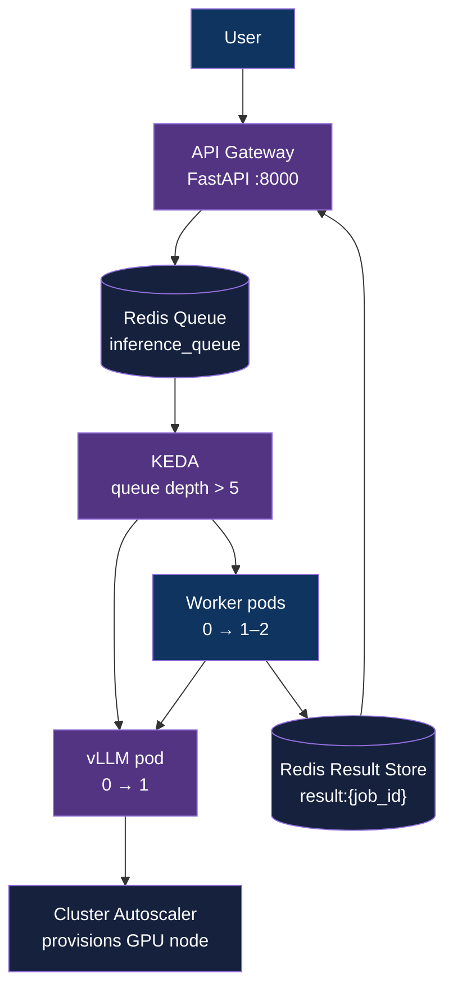

<div align="center">

# gpu-autoscale-inference

[](https://www.python.org/downloads/)
[](https://kubernetes.io/)
[](LICENSE)
[](#)

**A scale-to-zero GPU inference platform — GPU nodes provision on demand, cost is $0 when idle.**

[Architecture](#architecture) | [Getting Started](#getting-started) | [Demo](#demo)

</div>

---

## Table of Contents

- [Overview](#overview)
- [Features](#features)
- [Tech Stack](#tech-stack)
- [Architecture](#architecture)
- [Getting Started](#getting-started)
- [How It Works](#how-it-works)
- [Demo](#demo)
- [Cold Start Optimization](#cold-start-optimization)
- [Observability](#observability)
- [Project Structure](#project-structure)
- [Roadmap](#roadmap)
- [Author](#author)

## Overview

This project demonstrates production-grade AI infrastructure: an LLM inference platform with fully elastic GPU provisioning. Requests are queued in Redis; when queue depth crosses a threshold, KEDA triggers event-driven pod autoscaling from zero replicas. On GKE, the Cluster Autoscaler provisions a GPU node in response to pending pods with `nvidia.com/gpu` resource requests — achieving true scale-to-zero at both the pod and node level.

vLLM serves inference using continuous batching, with model weights persisted on a PersistentVolumeClaim and container image layers pre-cached via GKE Secondary Boot Disk — reducing cold start from ~9 minutes to ~5 minutes.

## Features

- **Scale-to-zero GPU nodes** — Cluster Autoscaler provisions/deprovisions GPU VMs based on pending pod scheduling; $0/hr when idle
- **Event-driven pod autoscaling** — KEDA ScaledObjects watch Redis queue depth, scaling worker and vLLM Deployments between 0 and N replicas
- **Queue-buffered inference** — Redis absorbs request bursts during cold start; no dropped traffic, no client-side retry needed
- **Continuous batching** — vLLM batches concurrent requests at the attention layer, maximizing GPU throughput per dollar
- **Cold start optimization** — model weights on PVC (survives pod churn) + container image layer caching via GKE Secondary Boot Disk
- **GPU telemetry** — NVIDIA DCGM exporter for utilization, power draw, and VRAM; vLLM Prometheus exporter for KV cache, TTFT, and throughput; kube-state-metrics for pod/node lifecycle

## Tech Stack

| Layer | Tool | Role |
|---|---|---|
| API Gateway | FastAPI | Async request ingestion, job ID issuance |
| Message Queue | Redis (+ redis-exporter) | Job buffering, result store (5 min TTL) |
| Pod Autoscaler | KEDA ScaledObject | Event-driven 0↔N scaling on queue depth |
| Node Autoscaler | GKE Cluster Autoscaler | GPU VM provisioning on pending pod |
| Inference Engine | vLLM (OpenAI-compatible) | Continuous batching, KV cache, Prometheus metrics |
| Model | Qwen/Qwen2.5-1.5B-Instruct | 3.5 GB VRAM, ~100 tok/s on L4 |
| GPU Telemetry | NVIDIA DCGM exporter | GPU utilization, power, memory via Prometheus |
| Cluster Metrics | kube-state-metrics | Pod replica counts, node capacity, deployment state |
| Dashboarding | Grafana (12 panels) | Queue depth, GPU util, TTFT, tokens/sec, node count |
| Load Testing | Locust | Concurrent prompt injection for scaling validation |

## Architecture



### Autoscaling Layers

| Layer | Mechanism | Trigger | Scales | Latency |
|---|---|---|---|---|
| Pod | KEDA ScaledObject → HPA | `redis_key_size{key="inference_queue"}` > 5 | Worker Deployment 0↔2, vLLM Deployment 0↔1 | ~30s (KEDA polling) |
| Node | GKE Cluster Autoscaler | Pending pod with `nvidia.com/gpu: 1` resource request | GPU VM (g2-standard-4, L4) 0↔1 | ~2 min (GCE instance boot) |
| Image | GKE Secondary Boot Disk | Node boot event | Container layer cache attached as local pd-ssd | ~0s (pre-attached) |
| Model | PersistentVolumeClaim | vLLM pod start | Qwen2.5-1.5B weights at `/root/.cache/huggingface` | ~128s (VRAM load) |

## Getting Started

### Prerequisites

- Python 3.12+
- Docker with NVIDIA GPU support
- k3d (Phase 1 local) or cloud CLI: `az` / `gcloud` (Phase 2)
- kubectl, helm

### Phase 1 — Local

```bash
# 1. Start vLLM on host (uses local GPU directly)
docker run --gpus all -p 8000:8000 --ipc=host \
  vllm/vllm-openai --model Qwen/Qwen2.5-1.5B-Instruct \
  --max-model-len 4096 --gpu-memory-utilization 0.8 --enforce-eager

# 2. Create local k3d cluster
k3d cluster create llm-gateway --port "8080:80@loadbalancer"

# 3. Install KEDA
helm repo add kedacore https://kedacore.github.io/charts
helm install keda kedacore/keda --namespace keda --create-namespace

# 4. Deploy all manifests
kubectl apply -f k8s/

# 5. Run load test
source .venv/bin/activate
locust -f loadtest/locustfile.py --host http://localhost:8080
```

### Phase 2 — Cloud (GCP GKE)

```bash
# Deploy: creates GKE cluster, GPU node pool (T4 spot), pushes images, applies manifests
./scripts/deploy-gcp.sh

# Get gateway IP
GATEWAY_IP=$(kubectl get svc gateway -n llm-gateway -o jsonpath='{.status.loadBalancer.ingress[0].ip}')
curl http://$GATEWAY_IP/health

# Trigger scaling (6+ requests to exceed KEDA threshold)
for i in $(seq 1 6); do
  curl -s -X POST http://$GATEWAY_IP/generate \
    -H 'Content-Type: application/json' \
    -d '{"prompt":"Explain autoscaling"}' &
done

# Watch two-layer scaling
kubectl get nodes -w                    # GPU node appears (~2-4 min)
kubectl get pods -n llm-gateway -w      # vLLM + worker go Pending -> Running

# Load test
locust -f loadtest/locustfile.py --host http://$GATEWAY_IP

# Monitoring
kubectl port-forward svc/grafana 3000:3000 -n llm-gateway

# ALWAYS tear down after session (~$0.10/hr control plane + ~$0.15/hr GPU spot)
./scripts/destroy-gcp.sh
```

### Configuration

```bash
cp .env.example .env
```

<details>
<summary>Configuration reference</summary>

```bash
# Worker: vLLM server URL
# Phase 1 (host Docker): http://host.docker.internal:8000
# Phase 2 (K8s Service):  http://vllm:8000
VLLM_URL=http://host.docker.internal:8000

REDIS_HOST=redis
REDIS_PORT=6379
```

</details>

## How It Works

### 1. Request Flow

Every prompt is enqueued immediately. `/generate` always returns a `job_id`. No request blocks for inference.

### 2. Autoscaling Chain

```
Queue depth > 5 (KEDA ScaledObject trigger)
→ KEDA scales Worker Deployment 0→2, vLLM Deployment 0→1
→ vLLM pod enters Pending: requests nvidia.com/gpu: 1
→ Cluster Autoscaler provisions g2-standard-4 + L4 (spot, ~$0.15/hr)
→ GPU node boots with container image pre-cached (Secondary Boot Disk)
→ vLLM loads model weights from PVC into VRAM (3.5 GB, ~128s)
→ Readiness probe (httpGet /health, failureThreshold: 60) passes
→ Workers pull jobs via BRPOP, POST to vLLM /v1/completions
→ Results written to Redis (result:{job_id}, TTL 300s)
→ Queue drains → KEDA cooldown (300s) → pods scale to 0
→ Cluster Autoscaler: node unneeded 10 min → GPU VM deleted
```

### 3. Result Retrieval

Poll `GET /result/{job_id}`. Returns `{status: pending}` until inference completes, then `{status: done, response: "..."}`. Results expire after 5 minutes.

## Demo

Full-cycle run on GCP GKE (n1-standard-4, NVIDIA T4 Spot, us-east1-d) — 1762 requests across two phases at 5 req/s × 180s each, full scale-to-zero confirmed at T+2233s.

Run data: [`data/run-20260406-190041/`](data/run-20260406-190041/)


### What the dashboard shows

Two phases (translucent blue regions) and three event lines tell the full story:

**Phase 1 — Cold Start (19:00:56 → 19:15:25, T+15s → T+884s)**
- 873 requests fired at 5 req/s for 180s, then queue holds while system cold-starts from zero
- KEDA scales worker 0→1→2 and vLLM 0→1 within ~30s of queue threshold breach
- Cluster Autoscaler provisions GPU node (~2.5 min); image loads from Secondary Boot Disk (~7s); model loads from PVC into VRAM (~2 min)
- First completions at T+576s; queue drains by T+595s
- **Real-world resilience event**: a Spot preemption hit at T+332s mid-cold-start — KEDA + Cluster Autoscaler self-healed in 105s without manual intervention or lost requests (see self-heal screenshot below)

**Valley — 60s baseline pause**
- Queue at 0; pods and GPU node remain warm

**Phase 2 — Warm Continuous Load (19:16:40 → 19:21:46, T+959s → T+1265s)**
- 889 requests fired at 5 req/s for 180s into a warm system
- Queue stays low — workers + vLLM consume in real time, no cold start overhead
- Total Phase 2 duration: 306s (fire + drain), GPU utilization plateaus at full

**Cool down**
- Pods scaled to 0 at T+1609s (KEDA cooldown complete, ~5m44s after queue idle)
- GPU node removed at T+2233s (Cluster Autoscaler scale-down, ~10m24s after pods zero)
- Full zero state — cost drops to $0/hr

### Spot preemption resilience


Mid-cold-start at T+332s, GCP reclaimed the Spot GPU node. KEDA detected the lost vLLM/worker pods, the Cluster Autoscaler provisioned a replacement node, and vLLM cold-started a second time — all within 105s. The Redis queue absorbed the gap; no requests were dropped, no client retry logic was needed. The two-layer autoscaler design (KEDA for pods, Cluster Autoscaler for nodes) is what makes this kind of failure self-healing rather than fatal.

### Benchmark numbers (GCP GKE, NVIDIA T4 Spot, run-20260406-190041)

| Metric | Value | Notes |
|---|---|---|
| Cold start (queue → vLLM ready) | **595s** | inflated by mid-run Spot preemption + recovery |
| Warm continuous load (889 reqs @ 5 r/s) | **306s** | fire + drain, no backlog |
| Pods → 0 after queue idle | **~5m44s** | KEDA cooldown |
| GPU node → 0 after pods zero | **~10m24s** | Cluster Autoscaler scale-down delay |
| Total run duration (T0 → full zero) | **2233s (~37 min)** | end-to-end demo cycle |
| Cost when idle | **$0/hr** | scale-to-zero confirmed |

## Cold Start Optimization

Cold start is the dominant cost in scale-to-zero GPU inference. The baseline took **11 min (659s)** end-to-end — almost all of it spent pulling an 11 GB container image over the network to a freshly provisioned GPU node. After two stacked optimizations, cold start dropped to **5.6 min (338s)** — a **48% reduction**.

All numbers below are from the same hardware: GCP GKE, **NVIDIA T4 Spot, n1-standard-4, us-east1-d**, measured 2026-04-05.

### The baseline (11 GB baked image, no PVC)

The original `vllm-custom/Dockerfile` baked Qwen2.5-1.5B's 3.5 GB weights directly into the vLLM base image — producing an 11 GB image. This was the wrong tradeoff: it added 3.5 GB to every cold-start image pull (~1.5 min) to save a 29 s HuggingFace download. Net effect: cold start got *slower*.

| Phase | Duration | Bottleneck |
|---|---|---|
| GPU node provision (GCE boot + NVIDIA driver) | ~2.5 min | GCE API + driver init |
| Container image pull (11 GB) | **~6.5 min** | Network I/O — 28 MB/s ceiling on 4-vCPU containerd |
| vLLM Python/CUDA boot + model load (from baked image) | ~2 min | CUDA init + 3.5 GB → VRAM |
| **Total** | **~11 min (659s)** | |

The 28 MB/s pull speed is **not** network-bandwidth-limited (g2-standard-4 has 10 Gbps). It is bottlenecked by containerd's 3-concurrent-layer pull cap and CPU-side decompression on a 4-vCPU node. No GKE config knob exposes `max_concurrent_downloads`.

### Optimization 1 — PersistentVolumeClaim for model weights

- Removed model baking from `vllm-custom/Dockerfile`; reverted to stock `vllm/vllm-openai:latest` (~8 GB)
- Added one-time `snapshot_download` Job that writes Qwen2.5-1.5B to a 10 Gi PVC
- vLLM mounts the PVC at `/root/.cache/huggingface` via `HF_HOME`
- PVC (GCE Persistent Disk) survives pod restarts and node deletion

**What it actually fixed**: reversed the bad bake-the-model decision and shrunk the image from 11 GB → 8 GB — saving ~1.5 min of pull time. This step alone is *not* dramatic, but it is the prerequisite for Optimization 2: a stock 8 GB image is something a generic disk image can pre-cache.

### Optimization 2 — GKE Secondary Boot Disk

- Built a GCE disk image with the 8 GB vLLM container layers pre-extracted into containerd's image store (`gke-disk-image-builder` from `github.com/ai-on-gke/tools`, ~10 min build)
- GPU node pool boots with the disk attached at `mode=CONTAINER_IMAGE_CACHE`
- containerd finds the image already on local pd-ssd — **no network pull**
- Required `--enable-image-streaming` flag to unlock the secondary-boot-disk plugin (image streaming itself is *not* used — it hurt vLLM in a prior experiment)

Disk image: `vllm-node-cache-20260405` (50 GB, us-east1-d). Rebuild only when vLLM version changes.

### Result — improvement from each attempt

| Phase | Baseline (11 GB baked) | After Opt 1 (PV only) | After Opt 1 + Opt 2 (PV + SBD) |
|---|---|---|---|
| GPU node provision | ~2.5 min | ~2.5 min | ~2.5 min |
| Container image pull | **~6.5 min** (11 GB) | **~5 min** (8 GB) | **~30 s** (local disk) |
| vLLM boot + model load to VRAM | ~2 min (baked) | ~2.5 min (PVC → VRAM) | ~2.5 min (PVC → VRAM) |
| **Total** | **~11 min (659s)** ✅ measured | **~10 min** ⚠ estimated | **~5.6 min (338s)** ✅ measured |
| **Savings vs baseline** | — | **~1.5 min (~14%)** | **~5.4 min (~48%)** |

> ⚠ The "PV only" column is computed from the 8 GB image-pull math + observed PVC load time. It was never run in isolation as a separate benchmark — the two optimizations were measured together.

### Why the remaining 5.6 min cannot easily go lower

| Phase | Duration | Why it stays |
|---|---|---|
| GCE boot + NVIDIA driver init | ~2.5 min | Outside GKE's control — hardware bring-up |
| Container start (image already local) | ~30 s | Pod scheduler + containerd unpack |
| 3.5 GB model from PVC → VRAM | ~2.5 min | Network-attached PD bandwidth, not GPU-bound |

Further reduction requires either GPU-aware node warming (a min-1 idle GPU node — defeats scale-to-zero) or moving the model into a tmpfs / Local SSD on the secondary boot disk itself (adds complexity, rebuild burden). Out of scope for v0.1.

### Approaches that did NOT work

| Approach | Verdict |
|---|---|
| GKE Image Streaming alone | ❌ Lazy remote IO killed Python/CUDA imports — measurably *worse* than baseline. Reverted. |
| eStargz / Stargz Snapshotter | ❌ GKE managed containerd blocks custom plugins |
| DaemonSet pre-pull on a min-1 node | ❌ Cache dies with the node on scale-to-zero |
| Artifact Registry tuning | ❌ No knobs exposed for `max_concurrent_downloads` |
| min-1 GPU node always-on | ❌ Defeats the FinOps story ($0.70/hr ongoing) |

## Observability

Four Prometheus exporters feed a 12-panel Grafana dashboard:

| Exporter | Endpoint | Key Metrics |
|---|---|---|
| redis-exporter | `:9121` | `redis_key_size{key="inference_queue"}` — queue depth |
| DCGM exporter | `:9400` | `DCGM_FI_DEV_GPU_UTIL`, `DCGM_FI_DEV_POWER_USAGE`, `DCGM_FI_DEV_FB_USED` |
| vLLM (built-in) | `:8000` | `vllm:num_requests_running`, `vllm:kv_cache_usage_perc`, `vllm:generation_tokens_total`, `vllm:time_to_first_token_seconds_bucket` |
| kube-state-metrics | `:8080` | `kube_deployment_status_replicas`, `kube_node_status_capacity{resource="nvidia_com_gpu"}` |

Scrape interval: 15s. Retention: 24h. No persistent storage (acceptable for demo; production would use Thanos or Grafana Cloud remote write).

### Full-Cycle Event Logging

`scripts/full-cycle-run.sh` executes a complete scale-to-zero → cold start → warm response → scale-to-zero cycle and captures raw event logs from every layer of the stack.

**Run it:**
```bash
./scripts/full-cycle-run.sh [GATEWAY_IP]
```

**Output structure** — each run creates a timestamped directory in `data/`:
```
data/run-20260404-215500/
├── full-cycle.log          # Main log with all phases and status polling
├── k8s-events.log          # Raw K8s events (watch stream, unfiltered)
├── keda-events.log         # KEDA ScaleTargetActivated/Deactivated events
├── node-lifecycle.log      # GPU node provision/removal + TriggeredScaleUp events
├── pod-lifecycle.log       # vLLM/worker pod status over time
├── redis-queue.log         # Queue depth at each poll interval
├── worker-output.log       # Worker container stdout (job processing)
├── vllm-output.log         # vLLM container stdout (model load, inference)
├── timeline.log            # Key milestones with T+ offsets
└── summary.log             # Final benchmark numbers
```

**Sample timeline.log:**
```
T+0s    | 2026-04-04T21:55:00Z | PRE-FLIGHT COMPLETE — system at zero
T+1s    | 2026-04-04T21:55:01Z | PHASE 1 START — firing 30 requests (cold start)
T+2s    | 2026-04-04T21:55:02Z | PHASE 1 QUEUED — 30 jobs in inference_queue
T+45s   | 2026-04-04T21:55:45Z | vLLM READY — cold start = 45s
T+60s   | 2026-04-04T21:56:00Z | PHASE 1 ALL SAMPLES COMPLETE
T+62s   | 2026-04-04T21:56:02Z | PHASE 1 DONE — 62s total
T+122s  | 2026-04-04T21:57:02Z | PHASE 2 START — firing 100 requests (warm GPU)
T+152s  | 2026-04-04T21:57:32Z | PHASE 2 DONE — 30s total (warm response time)
T+452s  | 2026-04-04T22:02:32Z | PODS SCALED TO ZERO — KEDA cooldown complete
T+1052s | 2026-04-04T22:12:32Z | GPU NODE REMOVED — Cluster Autoscaler scale-down
T+1052s | 2026-04-04T22:12:32Z | COOL DOWN COMPLETE — full zero state
```

**Sample k8s-events.log (raw KEDA + Cluster Autoscaler events):**
```
TIME                  TYPE     REASON                      OBJECT                              MESSAGE
2026-04-04T21:55:05Z  Normal   KEDAScaleTargetActivated    ScaledObject/worker-autoscaler      Scaled apps/v1.Deployment llm-gateway/worker from 0 to 1, triggered by s0-redis-inference_queue
2026-04-04T21:55:05Z  Normal   KEDAScaleTargetActivated    ScaledObject/vllm-autoscaler        Scaled apps/v1.Deployment llm-gateway/vllm from 0 to 1, triggered by s0-redis-inference_queue
2026-04-04T21:55:06Z  Normal   TriggeredScaleUp            Pod/vllm-xxx                        Pod triggered scale-up: [{gpu-pool 0->1 (max: 1)}]
2026-04-04T21:55:36Z  Normal   Scheduled                   Pod/vllm-xxx                        Successfully assigned llm-gateway/vllm-xxx to gke-llm-gateway-gpu-pool-xxx
2026-04-04T21:55:40Z  Normal   Pulled                      Pod/vllm-xxx                        Successfully pulled image "us-docker.pkg.dev/.../vllm-openai:latest"
2026-04-04T22:02:05Z  Normal   KEDAScaleTargetDeactivated  ScaledObject/worker-autoscaler      Scaled apps/v1.Deployment llm-gateway/worker from 2 to 0
2026-04-04T22:02:05Z  Normal   KEDAScaleTargetDeactivated  ScaledObject/vllm-autoscaler        Scaled apps/v1.Deployment llm-gateway/vllm from 1 to 0
```

**Sample redis-queue.log:**
```
2026-04-04T21:55:02Z | queue=30
2026-04-04T21:55:17Z | queue=30
2026-04-04T21:55:32Z | queue=28
2026-04-04T21:55:47Z | queue=0
2026-04-04T21:57:02Z | queue=100
2026-04-04T21:57:17Z | queue=52
2026-04-04T21:57:32Z | queue=0
```

## Project Structure

```
gpu-autoscale-inference/
├── gateway/                         # FastAPI gateway
├── worker/                          # Redis queue consumer
├── k8s/                             # Cloud-agnostic K8s manifests
├── k8s-cloud/azure/                 # AKS-specific node pool + GPU tolerations
├── k8s-cloud/gcp/                   # GKE-specific node pool + GPU tolerations
├── monitoring/                      # Prometheus + Grafana config
├── loadtest/                        # Locust load test
├── scripts/
│   ├── deploy-gcp.sh               # Full GKE deploy (cluster + images + manifests)
│   ├── destroy-gcp.sh              # Tear down GKE resources
│   ├── build-node-cache.sh         # Build GKE secondary boot disk image
│   └── full-cycle-run.sh           # Full-cycle demo with comprehensive event logging
├── data/                            # Runtime artifacts (gitignored)
│   └── run-YYYYMMDD-HHMMSS/        # Per-run directory with 10 log files
└── docs/                            # Research docs + optimization plans
```

## Roadmap

See [ROADMAP.md](ROADMAP.md) for detailed version history and plans.

- [x] Repository scaffolded
- [x] v0.1 Phase 1 — Local GPU prototype (k3d)
- [x] v0.1 Phase 2 — Cloud GPU deployment (GCP GKE)
- [x] v0.1 Phase 3 — Cold start optimization (PV for model weights + GKE Secondary Boot Disk)
- [ ] v0.2 — SSE streaming, model multiplexing

## Author

**Adityo Nugroho** ([@adityonugrohoid](https://github.com/adityonugrohoid))

## Acknowledgments

- [vLLM](https://github.com/vllm-project/vllm) — high-throughput LLM inference engine
- [KEDA](https://keda.sh) — Kubernetes Event-driven Autoscaling
