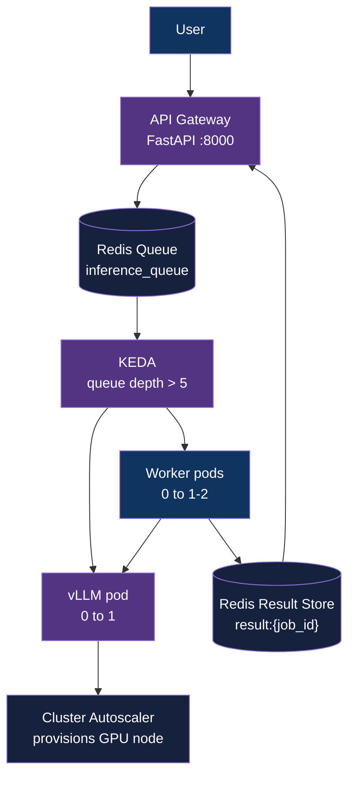

<div align="center">

# Scale-to-Zero GPU Inference

[](https://www.python.org/downloads/)
[](https://kubernetes.io/)
[](LICENSE)

**Scale-to-zero GPU inference platform: LLM serving on Kubernetes with KEDA pod autoscaling and Cluster Autoscaler node provisioning**

[Architecture](#architecture) | [Getting Started](#getting-started) | [Demo](#demo)

</div>

---

## Table of Contents

- [Features](#features)
- [Tech Stack](#tech-stack)
- [Architecture](#architecture)
- [Getting Started](#getting-started)
  - [Prerequisites](#prerequisites)
  - [Phase 1 - Local](#phase-1---local)
  - [Phase 2 - Cloud (GCP GKE)](#phase-2---cloud-gcp-gke)
  - [Configuration](#configuration)
- [Usage](#usage)
- [How It Works](#how-it-works)
- [API Reference](#api-reference)
- [Methodology](#methodology)
- [Results](#results)
- [Demo](#demo)
- [Project Structure](#project-structure)
- [Deployment](#deployment)
- [License](#license)
- [Author](#author)

## Features

An LLM inference platform whose core design decision is two independent autoscaling layers: KEDA scales pods on Redis queue depth, and the GKE Cluster Autoscaler scales the GPU node on pending pods, so idle cost is zero at both levels. Every request waits in the Redis queue; KEDA starts the worker and vLLM pods from zero replicas once queue depth crosses a threshold, and the pending vLLM pod's `nvidia.com/gpu` request is what brings up the GPU node. vLLM serves inference with continuous batching. Cold start is the price of scale-to-zero; measured on T4 Spot it went from about 11 min to about 5.6 min after moving weights to a PVC and pre-caching the image on a GKE secondary boot disk.

- **Scale-to-zero GPU nodes** - Cluster Autoscaler provisions and deprovisions GPU VMs based on pending pod scheduling; $0/hr when idle
- **Event-driven pod autoscaling** - KEDA ScaledObjects watch Redis queue depth, scaling worker and vLLM Deployments between 0 and N replicas
- **Queue-buffered inference** - Redis absorbs request bursts during cold start; no dropped traffic, no client-side retry needed
- **Continuous batching** - vLLM batches concurrent requests at the attention layer, maximizing GPU throughput per dollar
- **Cold start optimization** - model weights on PVC (survives pod churn) plus container image layer caching via GKE Secondary Boot Disk
- **GPU telemetry** - NVIDIA DCGM exporter for utilization, power draw, and VRAM; vLLM Prometheus exporter for KV cache, TTFT, and throughput; kube-state-metrics for pod and node lifecycle

## Tech Stack

| Layer | Tool | Role |
|---|---|---|
| API Gateway | FastAPI | Async request ingestion, job ID issuance |
| Message Queue | Redis (+ redis-exporter) | Job buffering, result store (5 min TTL) |
| Pod Autoscaler | KEDA ScaledObject | Event-driven 0 to N scaling on queue depth |
| Node Autoscaler | GKE Cluster Autoscaler | GPU VM provisioning on pending pod |
| Inference Engine | vLLM (OpenAI-compatible) | Continuous batching, KV cache, Prometheus metrics |
| Model | Qwen/Qwen2.5-1.5B-Instruct | 3.5 GB VRAM, ~50 tok/s aggregate generation on T4 |
| GPU Telemetry | NVIDIA DCGM exporter | GPU utilization, power, memory via Prometheus |
| Cluster Metrics | kube-state-metrics | Pod replica counts, node capacity, deployment state |
| Dashboarding | Grafana (12 panels) | Queue depth, GPU util, TTFT, tokens/sec, node count |
| Load Testing | Locust | Concurrent prompt injection for scaling validation |

## Architecture


```mermaid
graph TD
    U["User"] --> G["API Gateway\nFastAPI :8000"]
    G --> Q[("Redis Queue\ninference_queue")]
    Q --> K["KEDA\nqueue depth > 5"]
    K --> W["Worker pods\n0 to 1-2"]
    K --> V["vLLM pod\n0 to 1"]
    V --> CA["Cluster Autoscaler\nprovisions GPU node"]
    W --> V
    W --> R[("Redis Result Store\nresult:{job_id}")]
    R --> G

    style U fill:#0f3460,color:#fff
    style G fill:#533483,color:#fff
    style Q fill:#16213e,color:#fff
    style K fill:#533483,color:#fff
    style W fill:#0f3460,color:#fff
    style V fill:#533483,color:#fff
    style CA fill:#16213e,color:#fff
    style R fill:#16213e,color:#fff
```

### Autoscaling Layers

| Layer | Mechanism | Trigger | Scales | Latency |
|---|---|---|---|---|
| Pod | KEDA ScaledObject driving HPA | `redis_key_size{key="inference_queue"}` > 5 | Worker Deployment 0 to 2, vLLM Deployment 0 to 1 | ~30s (KEDA polling) |
| Node | GKE Cluster Autoscaler | Pending pod with `nvidia.com/gpu: 1` resource request | GPU VM (n1-standard-4, T4) 0 to 1 | ~2 min (GCE instance boot) |
| Image | GKE Secondary Boot Disk | Node boot event | Container layer cache attached as local pd-ssd | ~7s (local image load) |
| Model | PersistentVolumeClaim | vLLM pod start | Qwen2.5-1.5B weights at `/root/.cache/huggingface` | ~2.5 min (VRAM load) |

## Getting Started

### Prerequisites

- Python 3.12+
- Docker with NVIDIA GPU support
- k3d (Phase 1 local) or `gcloud` CLI (Phase 2 cloud)
- kubectl, helm

### Phase 1 - Local

```bash
# 1. Start vLLM on host (uses local GPU directly)
docker run --gpus all -p 8000:8000 --ipc=host \
  vllm/vllm-openai --model Qwen/Qwen2.5-1.5B-Instruct \
  --max-model-len 4096 --gpu-memory-utilization 0.8 --enforce-eager

# 2. Create local k3d cluster
k3d cluster create llm-gateway --port "8080:80@loadbalancer"

# 3. Install KEDA
helm repo add kedacore https://kedacore.github.io/charts
helm install keda kedacore/keda --namespace keda --create-namespace

# 4. Deploy all manifests
kubectl apply -f k8s/

# 5. Run load test
source .venv/bin/activate
locust -f loadtest/locustfile.py --host http://localhost:8080
```

### Phase 2 - Cloud (GCP GKE)

```bash
# The GCP scripts read the project id from the environment
export GCP_PROJECT=<your-gcp-project-id>

# Deploy: creates GKE cluster, GPU node pool (T4 spot), pushes images, applies manifests
./scripts/deploy-gcp.sh

# Get gateway IP
GATEWAY_IP=$(kubectl get svc gateway -n llm-gateway -o jsonpath='{.status.loadBalancer.ingress[0].ip}')
curl http://$GATEWAY_IP/health

# Trigger scaling (6+ requests to exceed KEDA threshold)
for i in $(seq 1 6); do
  curl -s -X POST http://$GATEWAY_IP/generate \
    -H 'Content-Type: application/json' \
    -d '{"prompt":"Explain autoscaling"}' &
done

# Watch two-layer scaling
kubectl get nodes -w                    # GPU node appears (~2-4 min)
kubectl get pods -n llm-gateway -w      # vLLM + worker go Pending to Running

# Load test
locust -f loadtest/locustfile.py --host http://$GATEWAY_IP

# Monitoring
kubectl port-forward svc/grafana 3000:3000 -n llm-gateway

# ALWAYS tear down after session (~$0.10/hr control plane + ~$0.11/hr GPU spot)
./scripts/destroy-gcp.sh
```

### Configuration

```bash
cp .env.example .env
```

<details>
<summary>Configuration reference</summary>

```bash
# Worker: vLLM server URL
# Phase 1 (host Docker): http://host.docker.internal:8000
# Phase 2 (K8s Service):  http://vllm:8000
VLLM_URL=http://host.docker.internal:8000

REDIS_HOST=redis
REDIS_PORT=6379
```

</details>

## Usage

Submit a prompt and poll for the result. The gateway never blocks on inference; every prompt is enqueued and returns a `job_id`.

```bash
# Submit a prompt (returns a job_id immediately)
curl -X POST http://$GATEWAY_IP/generate \
  -H 'Content-Type: application/json' \
  -d '{"prompt":"Explain autoscaling"}'

# Poll for the result
curl http://$GATEWAY_IP/result/{job_id}
```

## How It Works

### 1. Request Flow

Every prompt is enqueued immediately. `/generate` always returns a `job_id`. No request blocks for inference.

### 2. Autoscaling Chain

1. Queue depth crosses 5 (KEDA ScaledObject trigger).
2. KEDA scales the Worker Deployment from 0 to 2 and the vLLM Deployment from 0 to 1.
3. The vLLM pod enters Pending: it requests `nvidia.com/gpu: 1`.
4. Cluster Autoscaler provisions an n1-standard-4 plus T4 node (spot, ~$0.11/hr).
5. The GPU node boots with the container image pre-cached (Secondary Boot Disk).
6. vLLM loads model weights from the PVC into VRAM (3.5 GB, ~2.5 min).
7. The readiness probe (httpGet `/health`, `failureThreshold: 60`) passes.
8. Workers pull jobs via `BRPOP` and POST to vLLM `/v1/completions`.
9. Results are written to Redis (`result:{job_id}`, TTL 300s).
10. The queue drains, KEDA cooldown (300s) elapses, and pods scale to 0.
11. Cluster Autoscaler sees the node unneeded for 10 min and deletes the GPU VM.

### 3. Result Retrieval

Poll `GET /result/{job_id}`. Returns `{status: pending}` until inference completes, then `{status: done, response: "..."}`. Results expire after 5 minutes.

### 4. Observability

Four Prometheus exporters feed a 12-panel Grafana dashboard:

| Exporter | Endpoint | Key Metrics |
|---|---|---|
| redis-exporter | `:9121` | `redis_key_size{key="inference_queue"}` queue depth |
| DCGM exporter | `:9400` | `DCGM_FI_DEV_GPU_UTIL`, `DCGM_FI_DEV_POWER_USAGE`, `DCGM_FI_DEV_FB_USED` |
| vLLM (built-in) | `:8000` | `vllm:num_requests_running`, `vllm:kv_cache_usage_perc`, `vllm:generation_tokens_total`, `vllm:time_to_first_token_seconds_bucket` |
| kube-state-metrics | `:8080` | `kube_deployment_status_replicas`, `kube_node_status_capacity{resource="nvidia_com_gpu"}` |

Scrape interval: 15s. Retention: 24h. No persistent storage (acceptable for demo; production would use Thanos or Grafana Cloud remote write).

`scripts/full-cycle-run.sh` executes a complete scale-to-zero, cold start, warm response, then scale-to-zero cycle and captures raw event logs from every layer of the stack.

```bash
./scripts/full-cycle-run.sh [GATEWAY_IP]
```

Each run writes a timestamped directory of log files (gitignored; not committed). The excerpts below are from the recorded run `run-20260406-190041`, the same run as the Grafana screenshots in the Demo section:

```
data/run-20260406-190041/
├── full-cycle.log          # Main log with all phases and status polling
├── k8s-events.log          # Raw K8s events (watch stream, unfiltered)
├── keda-events.log         # KEDA ScaleTargetActivated/Deactivated events
├── node-lifecycle.log      # GPU node provision/removal + TriggeredScaleUp events
├── pod-lifecycle.log       # vLLM/worker pod status over time
├── redis-queue.log         # Queue depth at each poll interval
├── worker-output.log       # Worker container stdout (job processing)
├── vllm-output.log         # vLLM container stdout (model load, inference)
├── timeline.log            # Key milestones with T+ offsets
└── summary.log             # Final benchmark numbers
```

In this run `worker-output.log` and `vllm-output.log` are empty: the capture bug fixed in PRs #28 and #29. Lines are quoted as recorded, with three edits: the GCP project path is shortened to `...`, the em-dashes and the multiplication sign in `timeline.log` are written as `-` and `x`, and `...` marks omitted lines.

`timeline.log` (complete):

```
T+15s | 2026-04-06T12:00:56Z | PRE-FLIGHT COMPLETE - system at zero (no GPU node, no workers, no vLLM)
T+15s | 2026-04-06T12:00:56Z | PHASE 1 START - continuous load: 5 req/s x 180s (cold start)
T+196s | 2026-04-06T12:03:57Z | PHASE 1 FIRE STOP - 873 requests fired, awaiting cold-start completion
T+595s | 2026-04-06T12:10:36Z | vLLM READY - cold start = 595s
T+595s | 2026-04-06T12:10:36Z | PHASE 1 ALL SAMPLES COMPLETE - first completions at T+576s
T+884s | 2026-04-06T12:15:25Z | PHASE 1 DONE - 884s total, 873 requests fired
T+892s | 2026-04-06T12:15:33Z | VALLEY GAP START - 60s pause
T+950s | 2026-04-06T12:16:31Z | VALLEY GAP END
T+959s | 2026-04-06T12:16:40Z | PHASE 2 START - continuous load: 5 req/s x 180s (warm GPU)
T+1141s | 2026-04-06T12:19:42Z | PHASE 2 FIRE STOP - 889 requests fired, queue draining
T+1265s | 2026-04-06T12:21:46Z | PHASE 2 DONE - 306s total (warm response time)
T+1265s | 2026-04-06T12:21:46Z | COOL DOWN START
T+1609s | 2026-04-06T12:27:30Z | PODS SCALED TO ZERO - KEDA cooldown complete at T+1609s
T+2233s | 2026-04-06T12:37:54Z | GPU NODE REMOVED - Cluster Autoscaler scale-down at T+2233s
T+2233s | 2026-04-06T12:37:54Z | COOL DOWN COMPLETE - full zero state
```

`k8s-events.log` (excerpt: the scaling, scheduling, image pull and scale-down events of this run; its other events, and the events the watch stream replays from earlier runs, are left out):

```
TIME                   TYPE     REASON             OBJECT   MESSAGE
2026-04-06T12:01:19Z   Normal    KEDAScaleTargetActivated   <none>   Scaled apps/v1.Deployment llm-gateway/vllm from 0 to 1, triggered by s0-redis-inference_queue
2026-04-06T12:01:19Z   Normal    KEDAScaleTargetActivated   <none>   Scaled apps/v1.Deployment llm-gateway/worker from 0 to 1, triggered by s0-redis-inference_queue
2026-04-06T12:01:20Z   Normal    TriggeredScaleUp           <none>   Pod triggered scale-up: [{.../instanceGroups/gke-llm-gateway-gpu-pool-016163f0-grp 0->1 (max: 1)}]
2026-04-06T12:03:14Z   Normal    Scheduled                  <none>   Successfully assigned llm-gateway/vllm-5596dcdf9-v2w95 to gke-llm-gateway-gpu-pool-016163f0-6r8w
2026-04-06T12:03:25Z   Normal    Pulling                    <none>   Pulling image ".../vllm-openai:latest"
2026-04-06T12:03:33Z   Normal    Pulled                     <none>   Successfully pulled image ".../vllm-openai:latest" in 7.62s (7.62s including waiting). Image size: 9577341348 bytes.
2026-04-06T12:05:05Z   Normal    Killing                    <none>   Stopping container dcgm-exporter
2026-04-06T12:05:05Z   Normal    Killing                    <none>   Stopping container vllm
2026-04-06T12:07:55Z   Normal    Scheduled                  <none>   Successfully assigned llm-gateway/vllm-5596dcdf9-mmrvp to gke-llm-gateway-gpu-pool-016163f0-6r8w
2026-04-06T12:08:14Z   Normal    Pulled                     <none>   Successfully pulled image ".../vllm-openai:latest" in 7.016s (7.016s including waiting). Image size: 9577341348 bytes.
2026-04-06T12:26:19Z   Normal    KEDAScaleTargetDeactivated   <none>   Deactivated apps/v1.Deployment llm-gateway/vllm from 1 to 0
2026-04-06T12:26:19Z   Normal    KEDAScaleTargetDeactivated   <none>   Deactivated apps/v1.Deployment llm-gateway/worker from 2 to 0
2026-04-06T12:26:49Z   Normal    KEDAScaleTargetDeactivated   <none>   Deactivated apps/v1.Deployment llm-gateway/worker from 1 to 0
2026-04-06T12:36:30Z   Normal    ScaleDown                    <none>   deleting pod for node scale down
```

`redis-queue.log` (excerpt; the queue holds at 873 from 12:04:30Z to 12:10:03Z while the GPU node drops out and vLLM is rescheduled):

```
2026-04-06T12:01:25Z | queue=128
2026-04-06T12:03:50Z | queue=843
2026-04-06T12:04:30Z | queue=873
...
2026-04-06T12:10:03Z | queue=873
2026-04-06T12:10:36Z | queue=849
2026-04-06T12:12:46Z | queue=436
2026-04-06T12:15:25Z | queue=0
...
2026-04-06T12:17:08Z | queue=53
2026-04-06T12:19:30Z | queue=320
2026-04-06T12:21:46Z | queue=0
```

## API Reference

### Endpoints

| Method | Endpoint | Description |
|--------|----------|-------------|
| `POST` | `/generate` | Enqueue a prompt; returns a `job_id` immediately |
| `GET` | `/result/{job_id}` | Poll for a result; `pending` until done, then the response |
| `GET` | `/health` | Health check |

### Example Request

```bash
curl -X POST http://$GATEWAY_IP/generate \
  -H 'Content-Type: application/json' \
  -d '{"prompt":"Explain autoscaling"}'
```

### Example Response

```json
{
  "job_id": "a1b2c3d4"
}
```

## Methodology

Cold start is the dominant cost in scale-to-zero GPU inference. The baseline took **about 11 min** end-to-end, almost all of it spent pulling an 11 GB container image over the network to a freshly provisioned GPU node. After two stacked optimizations, cold start dropped to **about 5.6 min**, roughly half. Both totals were read from the Prometheus timeline at the time; neither is a committed log line. The closest recorded run, run-20260405-015400, shows first completions at T+305s and all samples complete at T+323s; no run directory exists for the baseline. See [docs/cold-start-optimization.md](docs/cold-start-optimization.md) for the full write-up.

All numbers below are from the same hardware: GCP GKE, **NVIDIA T4 Spot, n1-standard-4, us-east1-d**, measured 2026-04-05.

### The baseline (11 GB baked image, no PVC)

The original custom vLLM image baked Qwen2.5-1.5B's 3.5 GB weights directly into the vLLM base image, producing an 11 GB image. This was the wrong tradeoff: it added 3.5 GB to every cold-start image pull (~1.5 min) to save a 29s HuggingFace download. Net effect: cold start got *slower*.

| Phase | Duration | Bottleneck |
|---|---|---|
| GPU node provision (GCE boot + NVIDIA driver) | ~2.5 min | GCE API + driver init |
| Container image pull (11 GB) | **~6.5 min** | Network I/O, 28 MB/s ceiling on 4-vCPU containerd |
| vLLM Python/CUDA boot + model load (from baked image) | ~2 min | CUDA init + 3.5 GB into VRAM |
| **Total** | **~11 min** (Prometheus, no run directory) | |

The 28 MB/s pull speed is **not** network-bandwidth-limited (the n1-standard-4 NIC has multi-Gbps egress headroom). It is bottlenecked by containerd's 3-concurrent-layer pull cap and CPU-side decompression on a 4-vCPU node. No GKE config knob exposes `max_concurrent_downloads`.

### Optimization 1 - PersistentVolumeClaim for model weights

- Removed model baking from the custom vLLM image; reverted to stock `vllm/vllm-openai:latest` (~8 GB)
- Added a one-time `snapshot_download` Job that writes Qwen2.5-1.5B to a 10 Gi PVC
- vLLM mounts the PVC at `/root/.cache/huggingface` via `HF_HOME`
- The PVC (GCE Persistent Disk) survives pod restarts and node deletion

What it fixed: reversed the bake-the-model decision and shrank the image from 11 GB to 8 GB, saving ~1.5 min of pull time. This step alone is not dramatic, but it is the prerequisite for Optimization 2: a stock 8 GB image is something a generic disk image can pre-cache.

### Optimization 2 - GKE Secondary Boot Disk

- Built a GCE disk image with the 8 GB vLLM container layers pre-extracted into containerd's image store (`gke-disk-image-builder` from `github.com/ai-on-gke/tools`, ~10 min build)
- The GPU node pool boots with the disk attached at `mode=CONTAINER_IMAGE_CACHE`
- containerd finds the image already on local pd-ssd, so there is no network pull
- Required `--enable-image-streaming` to unlock the secondary-boot-disk plugin (image streaming itself is not used; it hurt vLLM in a prior experiment)

Disk image: `vllm-node-cache-20260405` (50 GB, us-east1-d). Rebuild only when the vLLM version changes.

### Approaches that did not work

| Approach | Verdict |
|---|---|
| GKE Image Streaming alone | Did not work. Lazy remote IO killed Python/CUDA imports, measurably *worse* than baseline. Reverted. |
| eStargz / Stargz Snapshotter | Did not work. GKE managed containerd blocks custom plugins. |
| DaemonSet pre-pull on a min-1 node | Did not work. Cache dies with the node on scale-to-zero. |
| Artifact Registry tuning | Did not work. No knobs exposed for `max_concurrent_downloads`. |
| min-1 GPU node always-on | Did not work. Defeats the FinOps story ($0.70/hr ongoing). |

## Results

### Cold start optimization

| Phase | Baseline (11 GB baked) | After Opt 1 (PV only) | After Opt 1 + Opt 2 (PV + SBD) |
|---|---|---|---|
| GPU node provision | ~2.5 min | ~2.5 min | ~2.5 min |
| Container image pull | **~6.5 min** (11 GB) | **~5 min** (8 GB) | **~7s** (local disk) |
| vLLM boot + model load to VRAM | ~2 min (baked) | ~2.5 min (PVC into VRAM) | ~2.5 min (PVC into VRAM) |
| **Total** | **~11 min** (Prometheus) | **~10 min** (estimated) | **~5.6 min** (Prometheus, run-20260405-015400) |
| **Savings vs baseline** | reference | **~1.5 min (~14%)** | **~5.4 min (about half)** |

Note: the "PV only" column is computed from the 8 GB image-pull math plus observed PVC load time. It was never run in isolation as a separate benchmark; the two optimizations were measured together.

### Why the remaining 5.6 min cannot easily go lower

| Phase | Duration | Why it stays |
|---|---|---|
| GCE boot + NVIDIA driver init | ~2.5 min | Outside GKE's control, hardware bring-up |
| Container start (image already local) | ~7s | Pod scheduler + containerd unpack |
| 3.5 GB model from PVC into VRAM | ~2.5 min | Network-attached PD bandwidth, not GPU-bound |

Further reduction requires either GPU-aware node warming (a min-1 idle GPU node, which defeats scale-to-zero) or moving the model into a tmpfs / Local SSD on the secondary boot disk itself (adds complexity and rebuild burden). Out of scope for v0.1.

### Full-cycle benchmark (GCP GKE, NVIDIA T4 Spot, run-20260406-190041)

1762 requests across two phases at 5 req/s for 180s each; full scale-to-zero confirmed at T+2233s.

| Metric | Value | Notes |
|---|---|---|
| Cold start (queue to vLLM ready) | **595s** | inflated by the mid-run Spot node loss and recovery |
| Warm continuous load (889 reqs @ 5 r/s) | **306s** | fire + drain, no backlog |
| Pods to 0 after queue idle | **~5m44s** | KEDA cooldown |
| GPU node to 0 after pods zero | **~10m24s** | Cluster Autoscaler scale-down delay |
| Total run duration (T0 to full zero) | **2233s (~37 min)** | end-to-end demo cycle |
| Cost when idle | **$0/hr** | scale-to-zero confirmed |

## Demo

Full-cycle run on GCP GKE (n1-standard-4, NVIDIA T4 Spot, us-east1-d), captured in run `run-20260406-190041`.


### What the dashboard shows

Two phases (translucent blue regions) and three event lines tell the full story.

**Phase 1 - Cold Start (19:00:56 to 19:15:25, T+15s to T+884s)**
- 873 requests fired at 5 req/s for 180s, then the queue holds while the system cold-starts from zero
- KEDA scales worker 0 to 1 to 2 and vLLM 0 to 1 within ~30s of the queue threshold breach
- Cluster Autoscaler provisions the GPU node (~2.5 min); the image loads from Secondary Boot Disk (~7s); the model loads from PVC into VRAM (about 2.5 min)
- First completions at T+576s and vLLM ready at T+595s; the queue drains to zero by T+884s
- Real-world failure: mid-cold-start the Spot GPU node dropped out (vLLM killed at T+264s). The same node rejoined the cluster 108s later, vLLM was serving at T+595s, and the queue held all 873 jobs through the gap (see the self-heal screenshot below)

**Valley - 60s baseline pause**
- Queue at 0; pods and GPU node remain warm

**Phase 2 - Warm Continuous Load (19:16:40 to 19:21:46, T+959s to T+1265s)**
- 889 requests fired at 5 req/s for 180s into a warm system
- Queue stays low: workers plus vLLM consume in real time, no cold start overhead
- Total Phase 2 duration: 306s (fire + drain), GPU utilization plateaus at full

**Cool down**
- Pods scaled to 0 at T+1609s (KEDA cooldown complete, ~5m44s after queue idle)
- GPU node removed at T+2233s (Cluster Autoscaler scale-down, ~10m24s after pods zero)
- Full zero state, cost drops to $0/hr

### Spot preemption resilience


Mid-cold-start, the Spot GPU node dropped out. At T+264s (12:05:05Z) the vLLM and DCGM exporter containers on it were killed, and by T+369s the cluster counted zero GPU nodes. No Preempted event was captured, so a Spot reclaim is inferred, not logged. GCE recreated the instance: the same node, `gke-llm-gateway-gpu-pool-016163f0-6r8w`, rejoined the cluster at 12:06:53Z, 108s after the containers stopped (the self-heal panel shows about 105s), and was Ready by 12:07:55Z, when the replacement vLLM pod was scheduled on it. The Cluster Autoscaler logged no new scale-up after 12:01:20Z; the vLLM Deployment had already created the replacement pod at 12:05:22Z, and it was serving at T+595s. The Redis queue held all 873 jobs through the gap and drained to zero by T+884s. The queue in front of the GPU tier is what let the jobs wait out the lost node.

## Project Structure

```
gpu-autoscale-inference/
├── gateway/                         # FastAPI gateway (main.py, job_queue.py, Dockerfile)
├── worker/                          # Redis queue consumer (worker.py, Dockerfile)
├── k8s/                             # Cloud-agnostic K8s manifests
├── k8s-cloud/gcp/                   # GKE-specific node pool + GPU tolerations
├── monitoring/                      # Prometheus + Grafana + DCGM config
├── loadtest/                        # Locust load test
├── scripts/
│   ├── deploy-gcp.sh               # Full GKE deploy (cluster + images + manifests)
│   ├── destroy-gcp.sh              # Tear down GKE resources
│   ├── deploy-local.sh             # Local k3d deploy
│   ├── destroy-local.sh            # Tear down local k3d cluster
│   ├── build-node-cache.sh         # Build GKE secondary boot disk image
│   └── full-cycle-run.sh           # Full-cycle demo with event logging
├── docs/                            # Research docs + optimization write-up + dashboard screenshots
├── data/                            # Runtime artifacts (gitignored)
└── .env.example                    # Configuration template
```

## Deployment

The full lifecycle is driven by shell scripts under `scripts/`. Container images come from upstream vLLM plus the component Dockerfiles in `gateway/` and `worker/`; there is no docker-compose stack.

### Local (k3d)

```bash
./scripts/deploy-local.sh
./scripts/destroy-local.sh
```

### Cloud (GCP GKE)

```bash
export GCP_PROJECT=<your-gcp-project-id>

# Creates the GKE cluster, GPU node pool (n1-standard-4 + T4 spot, 0-1 nodes),
# pushes images, and applies all manifests
./scripts/deploy-gcp.sh

# Build the secondary boot disk image used for fast cold starts
./scripts/build-node-cache.sh

# Tear everything down (control plane ~$0.10/hr + GPU spot ~$0.11/hr while running)
./scripts/destroy-gcp.sh
```

## License

This project is licensed under the [MIT License](LICENSE).

## Author

**Adityo Nugroho** ([@adityonugrohoid](https://github.com/adityonugrohoid))
